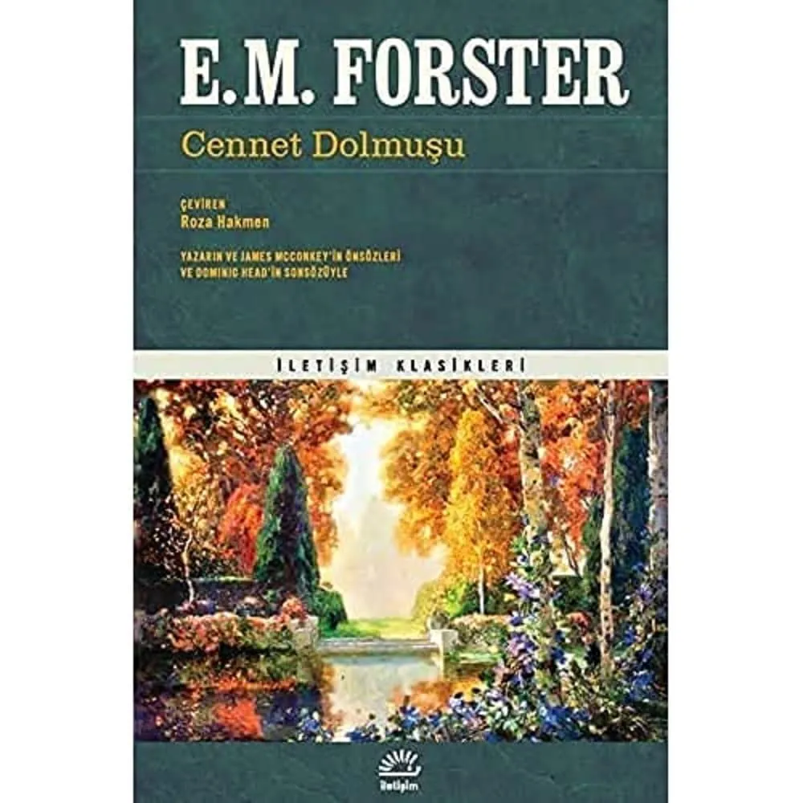

+++
title = "Bölüm 15'in Eksik Hikayesi: Makine Duruyor"
date = "2026-05-17T14:00:00+03:00"
author = "Alper Konuralp"
description = "Bölüm 15'te anlattığım ama ikimizin de adını hatırlayamadığı kitabı bulduk: E. M. Forster, 1909. 117 yıl önce yazılmış ama bugün okurken tüyleriniz diken diken oluyor."
tags = ["makine duruyor", "the machine stops", "e. m. forster", "bilim kurgu", "distopya", "bölüm 15", "kılavuzu kaybetmek", "hap bilgi", "yapay zeka", "teknoloji bağımlılığı"]
draft = false
+++

## Özet

*Yazan: Alper Konuralp*

Dinozorlarla Kafa Ütüleme serimizin 15\. bölümünde "Eğitilebiliyor muyuz? Kılavuzumuzu mu Kaybettik!" başlığı altında üç şey konuştuk:

1. Hap bilgi çağında öğrenmenin nereye gittiğini,
2. Soyutlamaların temel bilgiyi nasıl sildiğini,
3. Yapay zekanın bu denklemi nereye götürdüğünü.

Sohbetin ortasında ben, "şöyle bir kitap veya film vardı ama adını çıkartamıyorum şimdi" diye bir hikaye anlattım: insanlık yer altında, devasa bir "Makine"ye bağlı, kimse Makine'nin nasıl çalıştığını bilmiyor, sonunda makine duruyor ve medeniyet çöküyor. Burak ile ikimizin de o anda adı aklımıza gelmedi. Sonradan araştırdık ve bulduk: **E. M. Forster'ın 1909'da yazdığı "The Machine Stops"** — Türkçesi **"Makine Duruyor"** isimli hikayesi. Yazıldığı sene 1909. Telefon henüz lükstü, radyo çocukluğundaydı, internet bir yana, "video konferans" ifadesi bilim kurguda bile yoktu. Forster bütün bunları o tarihte, bir öyküde, neredeyse fotoğrafını çekerek yazmış. Bizi çok etkiledi. 1909 yılında birinin bu kadar ileri görüşlü olması! Çok hayret verici. İşte bu yüzden bu hikayeye bakma gereği hasıl oldu. Hadi gelin detaylara bir göz atalım.

## Hikayeyi Okumak İçin

Yazının ilerleyen bölümlerinde hikayenin olay örgüsünden parçalara değineceğim. Hikayeyi önce kendi başınıza okumak isterseniz, yazının kalanına geçmeden buradan başlayabilirsiniz:

- **Türkçe çeviri:** Roza Hakmen'in çevirisi *Cennet Dolmuşu* adlı Forster öykü derlemesinde yer alıyor (İletişim Yayınları, 2002). Sadece "Makine Duruyor"u değil, Forster'ın diğer öykülerini de bir arada okumak için ideal bir kitap: [Cennet Dolmuşu (Amazon)](https://amzn.eu/d/0ctHLcBd).
    
- **İngilizce orijinal metin (PDF):** [Machine_stops.pdf](https://www.cs.ucdavis.edu/~koehl/Teaching/ECS188/PDF_files/Machine_stops.pdf) — yaklaşık 12.300 kelime, bir akşam oturuşunda biter. İngilizce orijinal metin ABD kaynaklı arşivlerde public domain olarak sunuluyor; telif durumu ülkeye göre değişebilir.

Hikayeyi henüz okumadıysanız da yazıyı okuyabilirsiniz — olay örgüsünü ayrıntılı vermemeye dikkat ettim. Ama spoiler içeren bölümler var; o bölümlerin başında ayrıca uyaracağım.

## Forster ve 1909

Edward Morgan Forster (1879-1970), İngiliz edebiyatının önemli isimlerindendir. *A Passage to India*, *Howards End*, *A Room with a View* gibi sosyal roman geleneğinin önde gelen yapıtlarını yazdı. Bilim kurguya bir kere el attı, hayatı boyunca sadece tek bir tane bilim kurgu öyküsü yazdı. Bu hikayenin ismi de "The Machine Stops". Forster, 1947 tarihli Collected Short Stories önsözünde bu öyküyü H. G. Wells'in "erken cennetlerinden" birine — özellikle 1905 tarihli A Modern Utopia'ya — verilmiş bir tepki olarak konumlandırır. Wells, devlet eliyle örgütlenmiş, makine gibi işleyen bir teknolojik ütopya hayal etmişti. Forster bu hayale itiraz ediyor: ona göre teknolojinin nihai kontrolünü teknolojinin kendisi ele geçirir, insan değil.

1909'a bir bakalım: Ford Model T bir yıl önce piyasaya çıkmış, Wright kardeşler ilk uçuşunu yapalı altı yıl olmuş, Marconi telsizin Nobel'ini yeni almış. Telefon kentlerin lüksü, radyo deneysel, televizyon yok, internet kavramı portakalda vitamin bile değil. Ekran üzerinden konuşmak bilim kurguda bile yok, ha ne kadar bilim kurgu var, o da tartışılır tabiiki. Ve Forster oturup, bu dünyada, bugün okurken "ben yarın sabah uyandığımda bu adam tarafından izlenmek istemem" dedirten bir öyküyü yazıyor. Öykü kasım 1909'da *The Oxford and Cambridge Review*'da yayımlanıyor, daha sonra 1928'de *The Eternal Moment and Other Stories* derlemesine giriyor.

Forster'ın ne kadar sıra dışı bir hayal gücü olduğunu anlatmaya çalışmıyoruz. Forster'ın 1909'da, çevresinde hiçbir referansı yokken, bugünü betimlemesinin nasıl mümkün olduğunu anlamaya çalışıyoruz. Cevap büyük olasılıkla şu: Forster *teknolojiyi* tahmin etmedi, *insanı* anladı. Teknoloji boşluğa girince insanın ne yapacağını tahmin etti — ve teknolojinin nasıl görüneceğini tahmin etmek bunun yanında küçük bir mesele olarak kaldı.

## Hikaye

> ⚠️ **Spoiler uyarısı:** Buradan itibaren ve sonraki iki bölümde ("Forster Neyi Gördü?" ve "Bölüm 15 ile Köprü") hikayenin olay örgüsünden parçalar, alıntılar ve kapanışa dair imalar var. Hikayeyi önce orijinalinden okumak isterseniz, şu an köprüden önceki son çıkış :D

Hikaye yeraltındaki bir uygarlıkta geçiyor. Resmi anlatıya göre yüzey artık yaşanabilir değildir — insanlar dünyanın altında, bal peteğine benzeyen altıgen hücrelerde, her biri tek başına yaşıyor. Bütün ihtiyaçları "Makine" tarafından karşılanıyor: yemek, hava, müzik, ısı, ışık, iletişim, hatta "edebiyat" bile bir düğmeyle geliyor. Kimse kimseye fiziksel olarak temas etmiyor; etmek artık ayıp, kaba, "olmayan" bir şey.

Hikayenin başkahramanları Vashti ve oğlu Kuno. Vashti dünyanın güney yarımküresinde yaşıyor, Kuno kuzey yarımküresinde. Birbirlerini "mavi optik plaka" denilen bir cihaz üzerinden görüp duyuyorlar — yani bir tür video çağrısı. Vashti hayatını fikirler üzerine ders vererek, başkalarının derslerini dinleyerek, fikir alışverişinde bulunarak geçiriyor. Binlerce kişiyi "tanıyor" ama hiçbiriyle aynı odada bulunmadı.

Bir gün Kuno annesine bir şey söylemek istediğini, ama bunu Makine üzerinden değil, yüz yüze söylemek istediğini bildiriyor. *"I want to see you not through the Machine,"* ("Seni Makine üzerinden değil, yüz yüze görmek istiyorum.") diyor. *"I want to speak to you not through the wearisome Machine."* ("Seninle bu yorucu Makine'nin üzerinden değil, doğrudan konuşmak istiyorum."). Vashti şok oluyor — yolculuk yapmak, fiziksel temas, doğrudan deneyim... Hepsi onun için neredeyse barbarlık. Yine de yola çıkıyor.

Kuno'nun annesine söyleyeceği şey şu: gizlice yüzeye çıkmış. Dışarı çıkış izni (*Egression-permit*) almadan, Makine'nin onayı olmadan. Eski havalandırma şaftlarından tırmanıp dışarı çıkmış. Dışarıda — beklediğinin aksine — hayat var. Bitkiler, hava, gökyüzü, ve daha da önemlisi: o yüzeyde hala yaşayan insanlar var. "Evsiz" denilenler. Makine onları sürgün etmiş, ama ölmemişler. Saklanıyorlar.

Bundan sonrasını hikayeden okumanızı öneririz. Sadece şu kadarını söyleyelim: hikayenin adı "Makine Duruyor." Ve duruyor.

## Forster Neyi Gördü?

Hikayeyi bugün okurken çarpıcı olan şey, "vay 1909'da iyi tahmin etmiş" demek değil. Çarpıcı olan, bazı şeyleri *bizden bile daha net* görmüş olması.

### 1. Video Konferans ve Aradaki Eksiklik

Vashti ve Kuno'nun konuştuğu "mavi optik plaka" tam olarak bir Zoom çağrısı. Görüntü gecikmeli geliyor ("fully fifteen seconds before the round plate began to glow"), nüanslar kayboluyor, ama "pratik amaçlar için yeterli." Forster burada durup şunu söylüyor:
> Gözden düşmüş bir felsefenin insan ilişkisinin asıl özü olarak ilan ettiği o tarif edilemez pus, Makine tarafından haklı olarak göz ardı edilmişti — tıpkı üzümün tarif edilemez pusunun yapay meyve üreticileri tarafından göz ardı edildiği gibi.

Bu cümleyi 2020'lerin uzaktan çalışma tartışmalarına koyun. "Toplantı Zoom'da olur mu, ofiste mi olmalı?" sorusunun cevabı bu cümlede yatıyor. *O pus*. Forster tartışmayı 110 yıl önce kapatmış: olur, ama bir şey kaybedersiniz, ve o şeyi yerine koyamazsınız.

### 2. Binlerce Kişiyi Tanımak, Kimseye Dokunmamak

Vashti binlerce insanı tanıyor — onlarla fikir alışverişinde bulunuyor, derslerini dinliyor, mesaj yazıyor. Ama kimseyle aynı odada bulunmuyor. Hatta bir hostes uçakta dengesini kaybedince elini uzatıp tutuyor diye dehşete kapılıyor: *"İnsanlar birbirine dokunmazdı. Bu adet, Makine sayesinde demode olmuştu."*

Sosyal medya henüz yokken, takipçilerin icadından bir asır önce, Forster bağlantının niceliği ile yakınlığın niteliği arasındaki ters orantıyı görmüş. Bugün Instagram'da 5000 takipçimiz var, telefonda saatlerce vakit geçiriyoruz, ve evimizin kapısının önündeki komşumuzun ismini bilmiyoruz. Forster'ın şehri, içinde yaşadığımız şehrin haritası.

### 3. Hap Bilgi ve Onuncu Elden Fikirler

Hikayenin belki en sarsıcı yeri burası. Ünlü bir konferansçı şöyle bir ders veriyor:

> *"Birinci elden fikirlerden sakının! Birinci elden fikirler aslında yoktur. Onlar sevgi ve korkunun ürettiği fiziksel izlenimlerden ibarettir, ve bu kaba temel üzerine kim felsefe kurabilir? Fikirleriniz ikinci elden olsun, mümkünse onuncu elden, çünkü o zaman o tedirgin edici unsurdan — doğrudan gözlemden — uzak kalırlar."*

Fransız Devrimi üzerine ders veren biri olarak konuşuyor: "Devrimi olduğu gibi öğrenmeyin. Mirabeau'nun Fransız Devrimi hakkında söylediği şey üzerine Carlyle'ın ne düşündüğünü, onun üzerine Lafcadio Hearn'ün, sırasıyla Chi-Bo-Sing'in, Ho-Yung'un, Gutch'un, Urizen'in, Enicharmon'un ne düşündüğünü, ve en sonunda benim tüm bu zincir hakkında ne düşündüğümü öğrenin." On katmanlı yorumun süzgecinden geçmiş, gerçek olaydan tamamen kopmuş, "saf" bir fikir. Bunu istiyorlar.

Bunu bugünün hap bilgi kültürü ile yan yana koyun. TikTok özetleri, YouTube'daki "5 dakikada Savaş ve Barış" türü videolar, "özet geç" alışkanlığı, kitap okumak yerine kitap özetleri okumak. Daha da yenisi: AI'nin özetlediği kaynağı AI'ye özetletmek. Onuncu eli geçtik, on beşinciye yakınız. Forster bu eğilimin yönünü 1909'da işaret etmiş.

### 4. Soyutlamanın Temel Bilgiyi Silmesi

Bu, 15. bölümdeki tartışmamızın tam kalbi. Hikayede şöyle bir cümle var: *"Makine geliştikçe, ona artan verimle ve azalan zekayla hizmet ediliyordu. Bir adam kendi görevini ne kadar iyi bilirse, komşusunun görevini o kadar az anlıyordu, ve bütün dünyada Makine'yi bir bütün olarak anlayan tek bir kişi yoktu."*

Makine'yi yapan "büyük zihinler" çoktan ölmüş, geride talimatlar bırakmışlar, her yeni nesil bu talimatların kendi parçasını öğreniyor. Bütün, kimsenin kafasında değil. Bugün: 50 katmanlı framework yığınları, "low-code" platformlar, AI'nin yazdığı kod, "kütüphane ekle, sorun çözülsün" refleksi. *"npm install"* yapan junior developer, indirdiği paketin neden çalıştığını bilmek zorunda mı?

Vashti çağında değil. Forster çağında değil. 15. bölümde bunu konuştuk, ve sorduk: "Makine bozulduğunda kim tamir edecek?" Forster'ın hikayesinde cevap belli: kimse. Çünkü tamir edebilecek bilgi, bu dünyada tamir edilecek bir şey olduğu zamanlarda gerekliydi. Şimdi gerekli değil — ta ki bozulana kadar. Bozulduğunda da iş işten geçmiş oluyor.

### 5. "Bir Tuşa Bas, Sorun Çözülsün"

Vashti'nin odasında her şey bir düğmenin arkasında. Yemek düğmesi, müzik düğmesi, ısı düğmesi, hatta — bu özellikle dikkat çekici — "edebiyat" düğmesi. Bir düğmeye basıyorsun, edebiyat geliyor.

Bu satırı bugün okurken kafanıza dank eden şeyi söylemeye gerek yok herhalde. Aynı şeyi yapıyoruz. *"Bana 1500 kelimelik bir blog post yaz, tonu samimi olsun, başlık çekici olsun, SEO uyumlu olsun."* Düğmeye bas. Edebiyat gelsin.

Forster sadece düğmeyi görmemiş — düğmenin arkasındaki insanı da görmüş. O insanın bir süre sonra düğme olmadan ne yapacağını bilmediğini görmüş.

### 6. Doğrudan Deneyim Korkusu

Vashti hava gemisinin penceresinden güneşin yüzüne değme ihtimaliyle paniğe kapılıyor. Yere değmek, başka bir bedene dokunmak, yüzeyin tozuna basmak — hepsi neredeyse fiziksel bir tiksinti. "Yüzey toz ve çamurdur, başka bir şey değildir, üzerinde hayat kalmamıştır." Hava gemisindeki bir hostes "Asya'nın üzerindeyiz" deyince Vashti şaşkın tekrarlıyor: "Asya?" Hostes hemen özür diliyor — üzerinden geçtiği yerleri "mekanik olmayan" isimleriyle anma alışkanlığından kurtulamadığı için.

Bugün, "doğa yürüyüşüne gidelim" teklifine "üşürüm, sıcaklarım, böcek var, wi-fi çekmez" diye cevap veren bir nesil yetişiyor. Restoran seçerken Google review'a güveniyoruz, kendi damak tadımıza değil. Tanımadığımız bir yere giderken Maps olmadan yola çıkmıyoruz. Forster, konfor kabuğunun nasıl daralarak çekildiğini, doğrudan deneyimin nasıl bir tür barbarlık olarak görülmeye başlandığını öngörmüş. "Vashti was seized with the terrors of direct experience" — "Vashti'yi doğrudan deneyimin dehşeti sardı." 1909.

## Bölüm 15 ile Köprü

Bölümde ana mesajımız şuydu: hap bilgi çağında cevaplar bir tıkla geliyor, ama "nasıl" ve "neden" soruları kayboluyor. Şimdi Forster'ın hikayesini bu çerçeveden okuyun.

Hikayede her insanın bir "Kitabı" var — Makine'nin kullanım kılavuzu. Kitap, hangi düğmeye basılacağını söylüyor; ama düğmenin arkasında ne olduğunu, niye işe yaradığını anlatmıyor. İnsanlar bir noktada Kitap'a tapmaya başlıyorlar — öpüyorlar, başlarına koyuyorlar, sayfalarından dualar mırıldanıyorlar. Makine bozulmaya başladığında çareyi yine Kitap'ta arıyorlar. Ama Kitap, Makine'nin nasıl tamir edileceğini anlatmıyor — sadece Makine çalışırken hangi düğmeye basılacağını anlatıyor. Bu farkı kaçıranlar yok oluyor.

Bölümde "kılavuzu kaybettik" demiştik. Forster'ın hikayesinde kılavuz kaybedilmemiş — *kılavuz çoktan başka bir şey haline gelmiş*. Tamir bilgisini içermeyen, sadece kullanım talimatı sunan bir nesneye. Bugün dokümantasyonu çoktan bu şekilde okuyoruz: "şu hatayı veriyor, bunu nasıl çözerim?" sorusuna Stack Overflow'da cevap arıyoruz; cevabın *neden* çalıştığını çoğu zaman okumayız.

Hikayenin son sayfalarında, ölmek üzere olan Kuno annesine şunu söylüyor:

> *"Yüzeydekileri gördüm. Onlarla konuştum. Onları sevdim. Bizim medeniyetimiz duruncaya kadar saklanıyorlar. Bugün onlar Evsiz — yarın..."*

Vashti araya giriyor: *"Yarın, bir aptal Makine'yi tekrar çalıştıracak."*

Kuno: *"Asla. İnsanlık dersini öğrendi."*

Hikaye bu cümleden hemen sonra kapanıyor — medeniyetin çöküşüyle. Dersini öğrendi mi gerçekten? Forster'ın bilerek açık bıraktığı bu soru, 15. bölümün de aslında açık bıraktığı soruyla aynı. Biz mi öğreneceğiz dersi, yoksa hep birlikte makineyi yeniden mi çalıştıracağız?

## Kapanış: 1909'dan Bugüne

"Bilim kurgu" sözü bu hikaye için biraz aldatıcı. Forster bilim yazmamış — antropoloji yazmış. İnsanın bir aracı alıp evirip ona tapmaya başlama, sonra o aracın olmadığı bir dünyayı düşünemez hale gelme hikayesi. Bu hikayeyi yazmak için 1909'a, ya da 2026'ya, ya da hangi yüzyıla ait olduğunun bir önemi yok. İnsana bakmak yetiyor.

Forster'ın yazdığı şey geldi. Mavi optik plaka geldi, hap bilgi geldi, "edebiyat düğmesi" geldi, doğrudan deneyim korkusu geldi. Geriye bir tek şey kaldı: Makine'nin durup durmaması. Forster, durduğu senaryoyu yazdı. Henüz durmadı. Ama hikayenin asıl uyarısı "duracak" değil. Uyarı şu: *Makine zaten duruyor — biz farkına varmıyoruz, çünkü farkına varacak insan kalmadı.*

Kuno'nun annesine söylediği o cümleye kulak verin: "I want to see you not through the Machine" — "Seni Makine üzerinden değil, yüz yüze görmek istiyorum."

Kuno bu cümleyi 1909'da kurdu. Bugün, annenizi WhatsApp'tan arayıp da görüntülü konuşma sırasında "Anne, gel bir oturalım, çay içelim" dediğiniz an — kurduğunuz cümle tam olarak Kuno'nun cümlesi.

Hikayeyi okuyun. Bölümü izleyin. Sonra konuşalım.

## Kaynaklar

- **Bölüm 15:** [Eğitilebiliyor muyuz? Kılavuzumuzu mu Kaybettik!](https://youtu.be/nVFJLx6qIa8) — Dinozorlarla Kafa Ütüleme #15
- **The Machine Stops - E. M. Forster (Wikipedia)** — [en.wikipedia.org/wiki/The_Machine_Stops](https://en.wikipedia.org/wiki/The_Machine_Stops)
- **The Machine Stops - Tam Metin (PDF)** — [cs.ucdavis.edu](https://www.cs.ucdavis.edu/~koehl/Teaching/ECS188/PDF_files/Machine_stops.pdf)
- **Cennet Dolmuşu (Türkçe çeviri)** — çev. Roza Hakmen, İletişim Yayınları, 2002 — [Amazon](https://amzn.eu/d/0ctHLcBd)
- **E. M. Forster** — [Wikipedia](https://en.wikipedia.org/wiki/E._M._Forster)
- **E. M. Forster, *The Machine Stops* (1909)** — *The Oxford and Cambridge Review*, Kasım 1909; sonradan *The Eternal Moment and Other Stories* (1928) derlemesinde yayımlandı.
